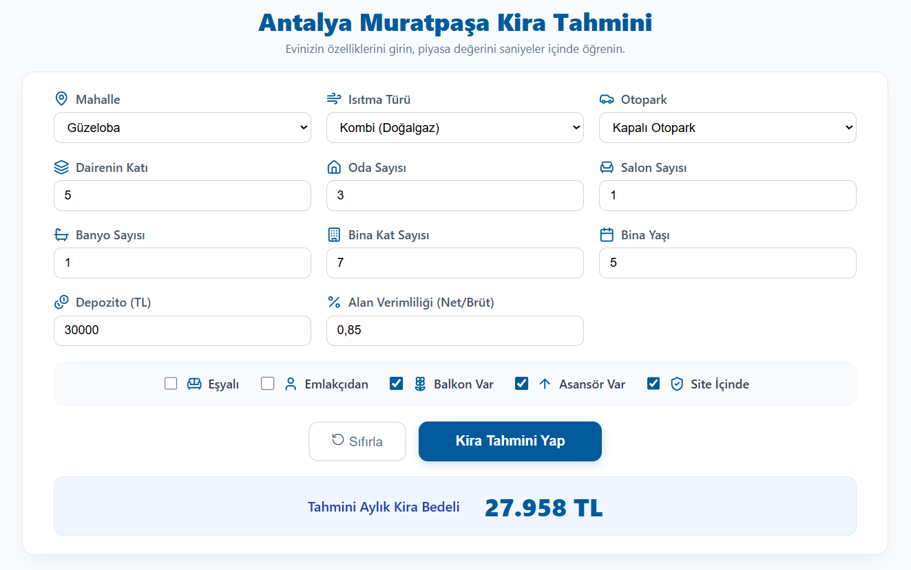

# Antalya Muratpaşa House Rental Price Prediction

A professional web application for predicting house rents in Antalya, Muratpaşa region using XGBoost machine learning.

<p align="center">
  
</p>

## Project Structure

```
House_Rental_Price_Prediction/
├── data/                      # Raw data folder
│   └── antalya_kiralik_ev.csv # Core dataset
├── backend/                   # FastAPI Backend
│   ├── src/                   # Source code
│   │   ├── main.py            # FastAPI application
│   │   ├── train_model.py     # Model training script
│   │   ├── constants.py       # Feature mappings
│   │   └── model.joblib       # Trained model file
│   ├── pyproject.toml         # UV project configuration
│   └── uv.lock                # UV lockfile
├── frontend/                  # React Frontend
│   ├── src/                   # React components & styles
│   ├── public/                # Static assets
│   └── package.json           # NPM configuration
└── README.md                  # This file
```

## How to Run

### 1. Prerequisites

- Python 3.10+ and UV package manager
- Node.js and NPM

### 2. Backend Setup

Navigate to the backend folder and run the API:

```bash
cd backend
uv run src/main.py
```

The API will be available at http://localhost:8000.

### 3. Frontend Setup

Navigate to the frontend folder and start the development server:

```bash
cd frontend
npm install
npm run dev
```

The application will be available at http://localhost:5173.

### 4. Training (Optional)

To retrain the model with fresh data:

```bash
cd backend
uv run src/train_model.py
```

## Tech Stack

- Backend: FastAPI, XGBoost, Pandas, Scikit-learn, UV
- Frontend: React, Vite, Lucide Icons, Vanilla CSS
